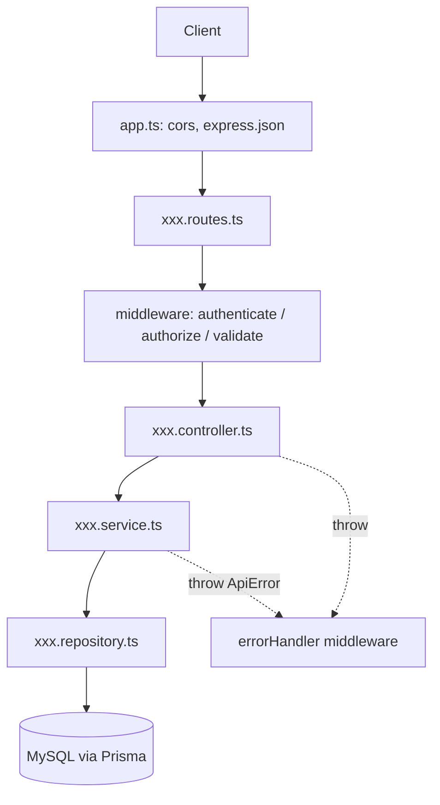

# Arsitektur

Aplikasi ini menggunakan dua pendekatan sekaligus:

1. **Layered Architecture** — tiap request mengalir melalui lapisan: Route → Middleware → Controller → Service → Repository → Prisma/DB.
2. **Modular Monolith** — kode di-grup per fitur bisnis (`auth`, `users`, `companies`, `app-modules`) di dalam satu aplikasi. Tiap modul berisi kelima lapisan-nya sendiri dan tidak saling memanggil langsung antar modul (kecuali helper/shared). Modul transaksional baru (inventory, sales, dst.) mengikuti pola yang sama + kolom `companyId` (lihat [multi-company.md](./multi-company.md)).

## Struktur Folder

```
express-boilerplate-multidb/
├── prisma/
│   ├── schema.prisma        # Definisi model & enum database
│   └── migrations/          # Hasil migrasi (auto-generated)
├── src/
│   ├── config/              # Konfigurasi: env, prisma client
│   ├── middlewares/         # Middleware global/bersama
│   ├── modules/             # Satu folder per fitur bisnis
│   │   ├── auth/
│   │   │   ├── auth.routes.ts
│   │   │   ├── auth.controller.ts
│   │   │   ├── auth.service.ts
│   │   │   └── auth.validation.ts
│   │   ├── users/
│   │   │   ├── user.routes.ts
│   │   │   ├── user.controller.ts
│   │   │   ├── user.service.ts
│   │   │   ├── user.repository.ts
│   │   │   └── user.validation.ts
│   │   ├── companies/
│   │   │   ├── company.routes.ts
│   │   │   ├── company.controller.ts
│   │   │   ├── company.service.ts
│   │   │   ├── company.repository.ts
│   │   │   └── company.validation.ts
│   │   └── app-modules/
│   │       ├── appModule.routes.ts
│   │       ├── appModule.controller.ts
│   │       └── appModule.service.ts
│   ├── utils/               # Helper: ApiError, jwt
│   ├── app.ts               # Setup express app & registrasi route
│   └── server.ts            # Entry point (listen)
├── doc/arsitektur/          # Dokumentasi ini
├── .env
└── tsconfig.json
```

## Alur Request

```
Client
  │ HTTP request
  ▼
app.ts (cors, express.json)
  │
  ▼
routes.ts        → routing + chain middleware (authenticate, authorize, validate)
  │
  ▼
controller.ts    → ekstrak input (params/body), panggil service, format response
  │
  ▼
service.ts       → business logic, aturan, cek keberadaan data, throw ApiError
  │
  ▼
repository.ts    → query database via Prisma Client
  │
  ▼
MySQL
```



Jika terjadi error di mana pun, Express 5 otomatis meneruskan ke `errorHandler`
(`src/middlewares/error.middleware.ts`) yang memetakan error menjadi HTTP response:

- `ZodError` → 400 + detail field
- `ApiError` → statusCode sesuai (400/401/403/404/409)
- Error lain → 500

## Tanggung Jawab Tiap Lapisan

| Lapisan | Boleh | Tidak Boleh |
|---|---|---|
| `routes.ts` | definisi endpoint, pasang middleware | logika bisnis |
| `controller.ts` | baca `req`, panggil service, tulis `res` | akses Prisma langsung |
| `service.ts` | business logic, validasi aturan bisnis, lempar `ApiError` | akses `req`/`res`, query Prisma langsung |
| `repository.ts` | query Prisma | logika bisnis, akses `req`/`res` |
| `validation.ts` | schema Zod (`xxxSchema`) | logika bisnis |
| `middlewares/` | auth (JWT), RBAC, validasi, error handling | query bisnis spesifik |

## Model Database (prisma/auth + prisma/transactions)

- DB auth: `User`, `Role`, `UserRole`, `Permission`, `RolePermission`,
  `Company`, `UserCompany`, `Module`, `CompanyModule` (lihat [multi-company.md](./multi-company.md)).
- DB transactions: diisi modul ERP baru, masing-masing model wajib punya
  `companyId` + index.

Aturan RBAC saat ini:
- Manajemen user (`/api/users`): hanya `ADMIN` (permission `users:manage`).
- Endpoint transaksional: user terautentikasi + member company aktif +
  modul ter-install + permission/resource yang sesuai.
